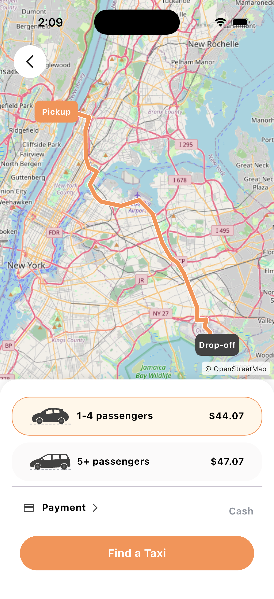
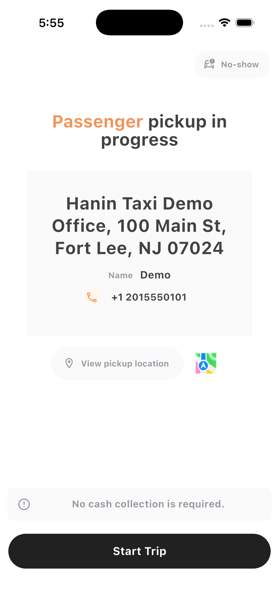

# Hanin Taxi

A team-built rider, driver, and dispatcher platform, restored as a reproducible
local demonstration. Flutter clients share trip state with an ASP.NET Core API
and a React operator dashboard.

[Product case study](https://www.woochangchang.com/hanin-taxi.html) |
[Architecture](docs/ARCHITECTURE.md) |
[Contribution scope](docs/CONTRIBUTIONS.md) |
[Verification](docs/VALIDATION.md)

<p>
  
  
</p>

Actual iOS simulator captures, using synthetic accounts in an internal-test environment.

## Start Here

| Engineering question                        | Implementation                                                                                                             | Evidence                                                                         |
| ------------------------------------------- | -------------------------------------------------------------------------------------------------------------------------- | -------------------------------------------------------------------------------- |
| Which driver is eligible for a request?     | [DispatchScoringService](backend/Services/DispatchScoringService.cs)                                                       | [24 dispatch tests](tests/HaninTaxi.Tests/DispatchScoringTests.cs)               |
| What if an old route arrives after a reset? | [TripController](rider-app/lib/controllers/trip_controller.dart)                                                           | [Delayed-response regression tests](rider-app/test/trip_route_request_test.dart) |
| How does a route avoid map controls?        | [Camera fitting](rider-app/lib/utils/route_camera.dart)                                                                    | [Viewport and inset tests](rider-app/test/route_camera_test.dart)                |
| Does settlement match the rider's quote?    | [Trip confirmation](backend/Controllers/TripController.cs), [payment completion](backend/Controllers/PaymentController.cs) | [Isolated demo API checks](scripts/test-demo.mjs)                                |

## My Role

I founded Hanin Taxi during graduate school, recruited a React engineer, a Flutter
engineer, and a Figma designer, and led product planning and delivery. I contributed
to APIs and selected Flutter/React implementation and reviewed the team's code.
The team-built platform became my M.S. capstone and led to continued work at
World Bankcard.

This snapshot separates the original team implementation from the October 2026
demo restoration and engineering review. See [contribution scope](docs/CONTRIBUTIONS.md).

## Run the Local Demo

Prerequisites: .NET SDK 10, Node.js 20 or later, Flutter 3.47.6 for the mobile apps,
and Xcode with an iOS simulator for iPhone testing.

From the repository root:

```bash
node scripts/start-demo.mjs
```

The server binds to `127.0.0.1:5050`, uses a new random signing key per launch,
and seeds an in-memory database. `PORT=5059` selects another port. `DOTNET_BIN`
can select a .NET executable that is not on PATH.

| Role       | Username        | Password   |
| ---------- | --------------- | ---------- |
| Rider      | `demo_customer` | `demo1234` |
| Driver     | `demo_driver`   | `demo1234` |
| Dispatcher | `demo_company`  | `demo1234` |

For the React dispatcher, in another terminal:

```bash
cd admin-dashboard
npm ci
cp .env.example .env.local
npm start
```

For the rider, in another terminal:

```bash
cd rider-app
flutter pub get
cp config/local.example.json config/local.json
flutter run -d "iPhone 17 Pro" --dart-define-from-file=config/local.json
```

The driver uses the same command from `driver-app`. Use `flutter devices` to find
your simulator's actual name. No Apple signing account is needed for the simulator.
Physical-device/LAN deployment is intentionally not configured in this snapshot.

The API flow works without paid-service credentials. A road-following rider route
requires your own Mapbox public token in the ignored `config/local.json`; add it
before running the app. Without it, the app does not draw a road route. OpenStreetMap tiles still require internet
and retain attribution. No live Stripe, Twilio, or database credentials are needed.

## Verify

```bash
# Source-pattern preflight, excluding generated files.
node scripts/check-public-source.mjs

# Backend build and dispatch rules, without external-service keys.
dotnet run --project tests/HaninTaxi.Tests --configuration Release

# Starts and stops its own API on a temporary loopback port.
node scripts/test-demo.mjs

# Run from each Flutter application directory.
flutter test

# Run from admin-dashboard.
npm ci
CI=true npm run build
```

[GitHub Actions configuration](.github/workflows/ci.yml) repeats these checks.
A workflow definition is not a claim that a remote run has passed. Local results
and unverified areas are recorded in [VALIDATION.md](docs/VALIDATION.md).

## Repository Map

| Directory          | Responsibility                                                      |
| ------------------ | ------------------------------------------------------------------- |
| `rider-app/`       | Booking, fare selection, map lifecycle, payment selection           |
| `driver-app/`      | Driver availability, acceptance, trip progress                      |
| `backend/`         | API, shared trip model, dispatch scoring, SignalR events            |
| `admin-dashboard/` | React operator interface                                            |
| `tests/`           | Backend regression coverage                                         |
| `scripts/`         | Isolated demo runner, API verification, source preflight            |
| `docs/`            | Architecture, contribution boundaries, verification and limitations |

## Scope

This is a local-only engineering demo with synthetic data. The API refuses to
start outside demo mode. Review [known limitations](docs/LIMITATIONS.md) before
extending it or considering any public service deployment.

The snapshot preserves team-built code. No new open-source license or ownership
transfer is granted here; redistribution of original assets and third-party
components needs to respect their respective rights.
