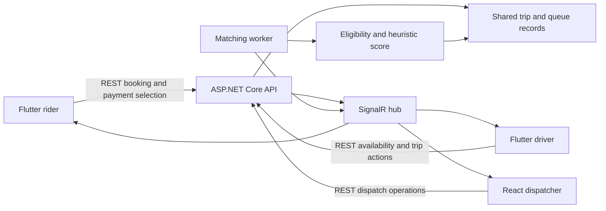
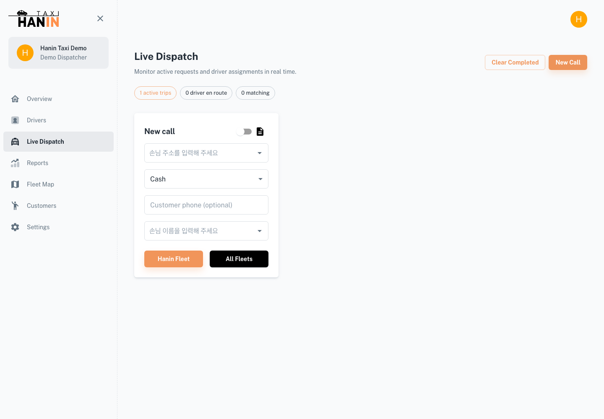

# Architecture and Code Walkthrough

## Shared Trip Lifecycle



The demo uses EF Core InMemory with synthetic accounts. PostgreSQL models and
legacy migrations are retained for review, but a PostgreSQL migration is not part
of the validated .NET 10 demo path.

## 1. Eligibility Before Ranking

[DispatchScoringService](../backend/Services/DispatchScoringService.cs) first
rejects non-waiting queues, company-mismatched requests, unsuitable vehicles,
previously rejected requests, and app-ride constraint failures. A high score
must never make an ineligible driver eligible.

Eligible candidates receive a deterministic score:

```text
max(0, 60 - pickupMiles * 8)
+ min(25, waitMinutes * 2)
+ airportBoost(0 or 5)
- min(15, declineCount * 5)
```

Waiting time is clamped to zero for future timestamps. The app-ride pickup search
radius is five miles plus whole minutes waited. These are prototype product rules,
not a learned model or a statement of current transport regulations.

The [matching worker](../backend/Managers/BackgroundManager.cs) visits waiting
drivers in queue order and chooses the highest-scoring eligible customer for each.
That is a greedy selection, not a globally optimal fleet assignment. The demo
endpoint instead picks the highest-scoring pair for one controlled matching step.
Neither path establishes concurrency-safe assignment across multiple API instances.

## 2. One Quote, Separate Payment State

[TripController.NewTrip](../backend/Controllers/TripController.cs) creates the
trip and returns small/large vehicle quotes. Confirmation selects the stored
quote according to vehicle size and initializes the payment record. Quotes are
rounded to cents before confirmation. Cash is recorded separately from card and
points amounts and is included in the payment total. Trip progress
and payment status are separate: arrival is not proof of settlement.

The [isolated API test](../scripts/test-demo.mjs) verifies the Fort Lee-to-JFK
$44.07 quote, matching, acceptance, trip completion, and a $44.07 zero-tip cash
settlement. It verifies synthetic records, not a Stripe charge or cash collection.
Live webhooks, retry idempotency, refunds, and reconciliation remain separate work.

## 3. Last Valid Route Request Wins

[TripController.setEstimatedRoute](../rider-app/lib/controllers/trip_controller.dart)
captures a monotonically increasing request version before awaiting routing.
Changing either endpoint, resetting the trip, or disposing the controller
invalidates earlier requests. A response is applied only if its version is current
and a trip is still set.

The [regression test](../rider-app/test/trip_route_request_test.dart) controls
response completion order using Dart Completers. It checks a reset during a pending
request, destination replacement, two requests completing out of order, and the
normal successful path. Ignoring a stale response does not cancel the HTTP request.

## 4. Map State Follows Trip State

[HomeScreen](../rider-app/lib/screens/home_screen.dart) distinguishes a full route
from an idle pickup. Route fitting runs after the fare panel's layout update so
the camera uses the available height. [fitRouteCamera](../rider-app/lib/utils/route_camera.dart)
reserves space for safe-area insets, the back control, and endpoint labels.

The previous animation is disposed before a new movement, including an immediate
idle reset. Camera tests project route points into two viewport sizes with two
top-inset values. They do not replace native screenshot review.

## 5. Repeatable, Isolated Verification

[test-demo.mjs](../scripts/test-demo.mjs) starts a separate in-memory API on a
temporary loopback port. It disables automatic matching during assertions, creates
only synthetic records, and terminates its child process in a finally block.
It never targets the user's existing simulator server or a public endpoint.

## 6. Operator Session and Browser Verification

The React application uses Vite and a client-side router. Public `VITE_*` variables
select the API and SignalR endpoints. The operator session uses Zustand persistence;
sign-out resets the active state and removes the refresh-token cookie. A failed
server logout still clears local state, but does not establish server-side revocation.

The [session test](../admin-dashboard/tests/session.test.mjs) guards against identity
remaining in persistence after reset. The [browser suite](../admin-dashboard/e2e/operator.spec.mjs)
builds the app, launches its own synthetic API, and checks desktop/mobile login,
dispatch navigation, reload, and failure recovery. It does not mock successful API responses.


